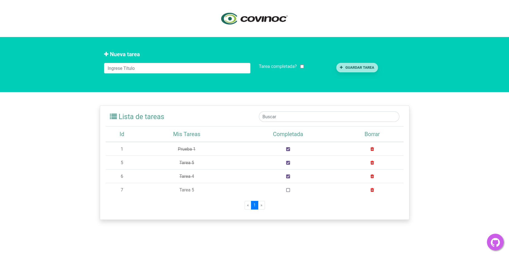
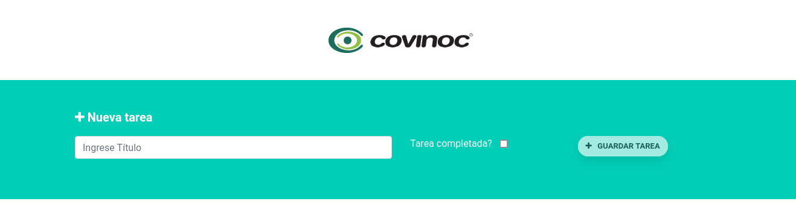
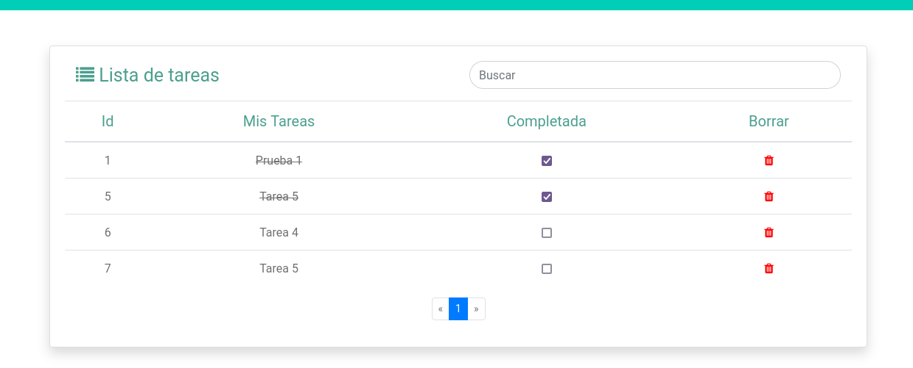
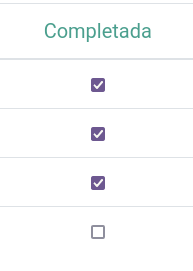
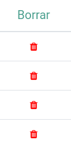

# Prueba Técnica Frontend - Covinoc

This project was generated with [Angular CLI](https://github.com/angular/angular-cli) version 11.2.19.

# Introducción

En este repositorio se encuentra la prueba técnica para el cargo de Frontend Developer,
siguiendo para ello las pautas indicadas en la maqueta establecida, a continuación mayor información
sobre las tecnologías utilizadas.

## Tecnologías utilizadas
* NodeJS v14
* Bootstrap 4
* Font Awesome v4
* Angular v11.2.9
* NPM

## Casos de uso

### Caso 1

El usuario debe poder ingresar tareas. las cuales deben aparecer en tiempo real en la Lista de Tareas

### Caso 2

El usuario podra buscar tareas a nivel de front.

### Caso 3

El usuario puede marcar las tareas como completadas.

### Caso 4

El usuario puede eliminar tareas de la lista

## Instalación de Dependencias
Run `npm install`

## Development server

Run `ng serve` for a dev server. Navigate to `http://localhost:4200/`. The app will automatically reload if you change any of the source files.

## Code scaffolding

Run `ng generate component component-name` to generate a new component. You can also use `ng generate directive|pipe|service|class|guard|interface|enum|module`.

## Build

Run `ng build` to build the project. The build artifacts will be stored in the `dist/` directory. Use the `--prod` flag for a production build.

## Running unit tests

Run `ng test` to execute the unit tests via [Karma](https://karma-runner.github.io).

## Running end-to-end tests

Run `ng e2e` to execute the end-to-end tests via [Protractor](http://www.protractortest.org/).

## Further help

To get more help on the Angular CLI use `ng help` or go check out the [Angular CLI Overview and Command Reference](https://angular.io/cli) page.
